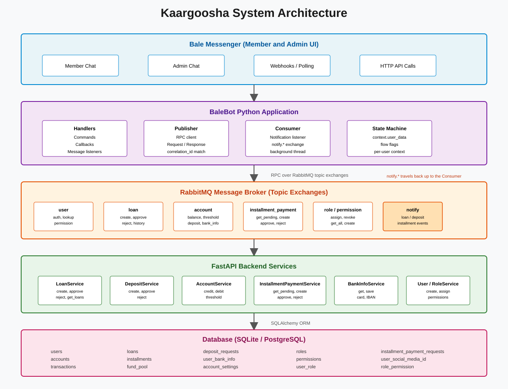
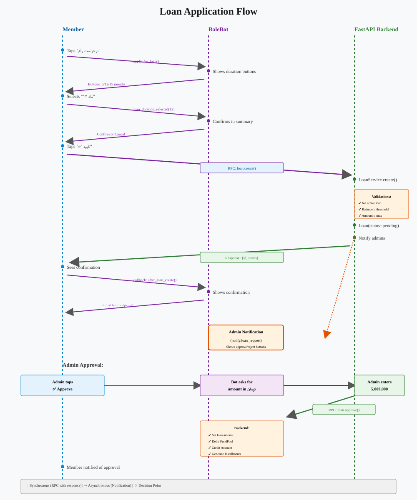
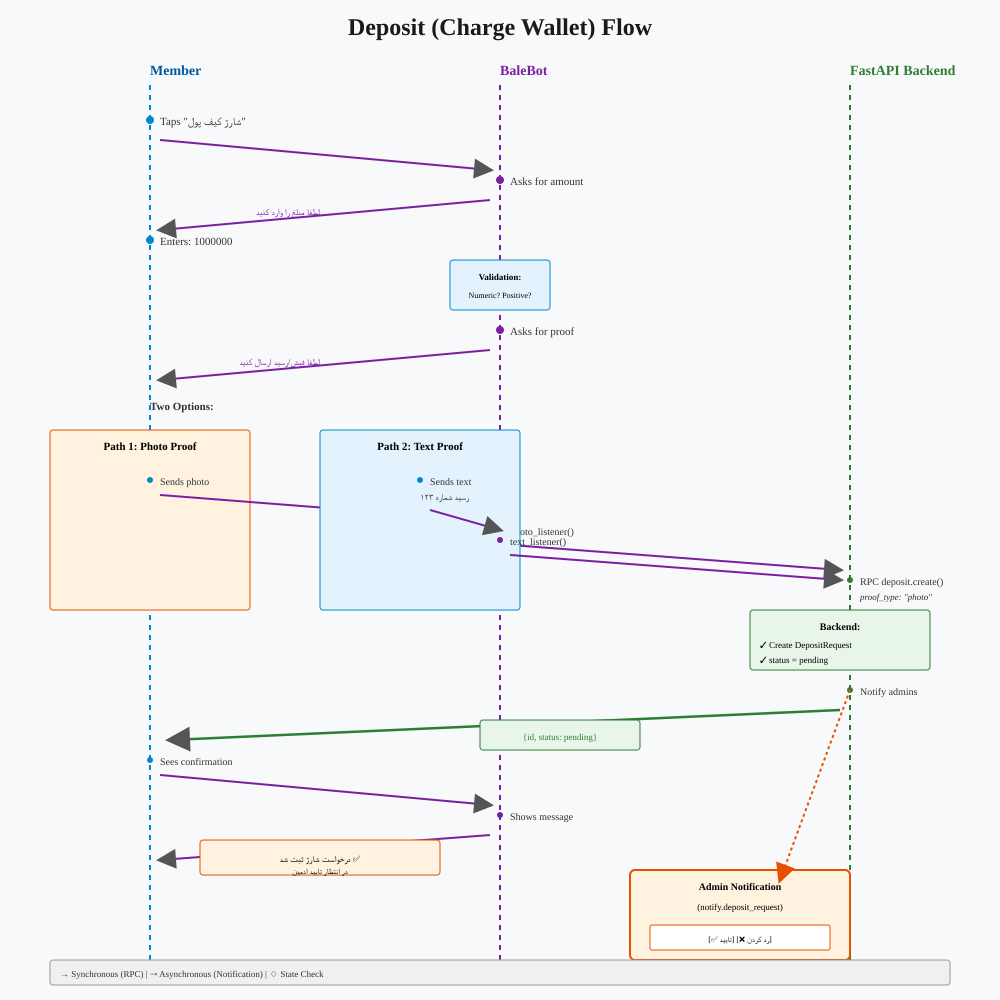
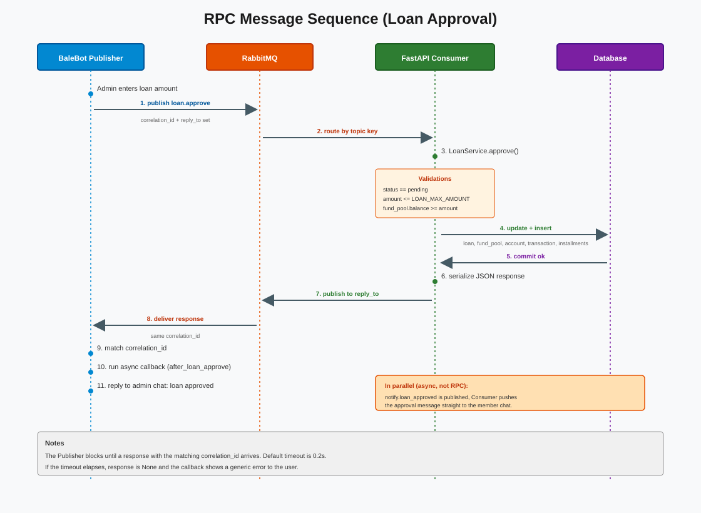

# Kaargoosha BaleBot

A comprehensive Telegram/Bale messenger bot for family microfinance: loan management, wallet charging, installment payments, and admin controls.

**Stack:** Python 3.10+, Python-Telegram-Bot v22, RabbitMQ (topic exchanges), AsyncIO

## Features

### For Members

- **Authentication** — Sign in with phone number or create new account
- **Loan Management**
  - Apply for loans with configurable duration (6/12/15 months)
  - View loan history with payment status and overdue tracking
  - Pay installments with photo/text proof
  - Real-time notifications on approval/rejection
  
- **Wallet Operations**
  - Charge wallet with photo/text proof of deposit
  - Track balance and transaction history
  - View and update bank information (card, IBAN)

### For Admins

- **Loan Administration**
  - Review pending loan requests with borrower history
  - Approve/reject loans with amount adjustment
  - View all loans filtered by status, date range
  - Track disbursements and fund pool balance

- **Deposit Management**
  - Review pending deposit proofs with member info
  - Approve/reject with admin notifications
  - Track wallet charges

- **Installment Approvals**
  - Review pending installment payment proofs
  - Approve/reject with detailed feedback

- **System Administration**
  - Manage user roles and permissions
  - Create/delete/revoke role permissions
  - Assign roles to users

## Quick Start

### Prerequisites

```bash
python 3.10+
RabbitMQ (running)
FastAPI backend (http://localhost:8000)
```

### Installation

```bash
cd Kaargoosha-BaleBot
pip install -r requirements.txt

# Create .env
cat > .env << EOF
BOT_TOKEN=your_bale_bot_token
BASE_URL=https://api.balem.io/bot/v1
RABBITMQ_HOST=localhost
RABBITMQ_PORT=5672
RABBITMQ_USERNAME=guest
RABBITMQ_PASSWORD=guest
EOF

python core/main.py
```

### Testing

```bash
export TEST_TELEGRAM_USER_ID=your_id
export TEST_USERNAME=your_username
export TEST_PHONE=09xxxxxxxxx
pytest tests/
```

## Architecture

The bot talks to the FastAPI backend over RabbitMQ topic exchanges using an RPC
(request/response) pattern, and receives admin/member notifications back through
the `notify.*` exchange.



## Diagrams

| Diagram | Description |
| --- | --- |
| [System Architecture](docs/diagrams/architecture_diagram.svg) | The five layers: Bale Messenger → BaleBot app → RabbitMQ → FastAPI services → Database |
| [Loan Flow](docs/diagrams/loan_flow_diagram.svg) | Member loan request, admin approval, and disbursement |
| [Deposit Flow](docs/diagrams/deposit_flow_diagram.svg) | Wallet charge: amount input, photo/text proof, admin approval |
| [RPC Message Sequence](docs/diagrams/message_sequence_diagram.svg) | Step-by-step request/response across Publisher → RabbitMQ → Consumer → Database |

### Loan Flow



### Deposit (Charge Wallet) Flow



### RPC Message Sequence



## Documentation

- 🖼️ [`docs/diagrams/`](docs/diagrams/) — Architecture and flow diagrams (SVG)

## Project Structure

```
core/
├── main.py           # Bot application, handlers, conversations
├── publisher.py      # RabbitMQ message publishing
├── consumer.py       # RabbitMQ notification listener
├── settings.py       # Configuration & logging
└── rabbitmq_connection.py

tests/
├── conftest.py       # Fixtures, helpers, mocking
├── test_auth.py      # Sign in / sign up flows
├── test_loan.py      # Loan application, duration, confirmation
├── test_bank_info.py # Bank info view/update
├── test_deposit.py   # Wallet charging
└── test_installment_payment.py

docs/
└── diagrams/
    ├── architecture_diagram.svg
    ├── loan_flow_diagram.svg
    ├── deposit_flow_diagram.svg
    └── message_sequence_diagram.svg
```

## Key Concepts

**State Machine (user_data)** — Tracks conversation state across updates:
- `flow` — Sign in/sign up workflow
- `loan_flow` — Loan application state
- `deposit_flag` — Wallet charging state
- `bank_info_flag` — Bank info editing field
- `installment_payment_proof_flag` — Installment selection waiting for proof

**RPC Pattern** — Request/response via RabbitMQ:
1. Bot publishes message with `reply_to` queue + `correlation_id`
2. FastAPI consumer processes, publishes response to `reply_to`
3. Bot listener matches `correlation_id`, runs callback with response

**Permissions** — Checked via `@permission(Permissions.LOAN_APPROVE)` decorator on backend service methods; admin buttons route only if user has role.

## Commands

- `/start` — Start/restart bot, main menu
- `/join` — Join from different platform (web, mobile)

## RabbitMQ Exchanges

| Exchange | Type | Routing Keys | Flow |
| --- | --- | --- | --- |
| `user` | topic | `user.create`, `user.check_phone_number`, `user.join`, `user.get_user_by_username`, `user.check_*_permission`, `user.update_chat_id` | Member auth, user lookup, permission checks |
| `loan` | topic | `loan.create`, `loan.approve`, `loan.reject`, `loan.get_client_history`, `loan.get_loans` | Loan workflow |
| `account` | topic | `account.get_balance`, `account.set_threshold` | Wallet balance, eligibility threshold |
| `bank_info` | topic | `bank_info.get`, `bank_info.save` | Bank data |
| `deposit` | topic | `deposit.create`, `deposit.approve`, `deposit.reject` | Wallet charging |
| `installment_payment` | topic | `installment_payment.get_pending`, `installment_payment.create`, `installment_payment.approve`, `installment_payment.reject` | Installment payments |
| `role` | topic | `role.create`, `role.get_all`, `role.delete`, `role.assign`, `role.get_user_roles`, `role.revoke` | Role management |
| `permission` | topic | `permission.get_role_permission`, `permission.get_all`, `permission.create`, `permission.revoke` | Permission management |
| `notify` | topic | `notify.loan_request`, `notify.loan_approved`, `notify.loan_rejected`, `notify.deposit_request`, `notify.installment_payment_request` | Admin notifications |

## Error Handling

- **KeyError** (after restart) → "ربات مجددا راه اندازی شده است. لطفا دوباره /start را بزنید"
- **Timeout** (RPC) → Generic error, user sees "پاسخی دریافت نشد"
- **Validation** → Specific messages (e.g., "شماره کارت باید ۱۶ رقم باشد")

## Testing

Run all tests:
```bash
pytest tests/ -v
```

Specific suite:
```bash
pytest tests/test_loan.py -v
```

Single test:
```bash
pytest tests/test_loan.py::TestLoanFlow::test_loan_confirm_sends_response -v
```

Tests use real RabbitMQ + FastAPI; HTTP calls mocked at class level (Message.reply_text, CallbackQuery.answer, bot.send_message).

## Contributing

1. Follow existing code style (snake_case, try/except with logger)
2. Add Persian strings for user-facing messages
3. Write tests for new flows
4. Never use print statements (forget-print rule)
5. Update docs/ if adding new features

## License

Proprietary — Family Microfinance Project
